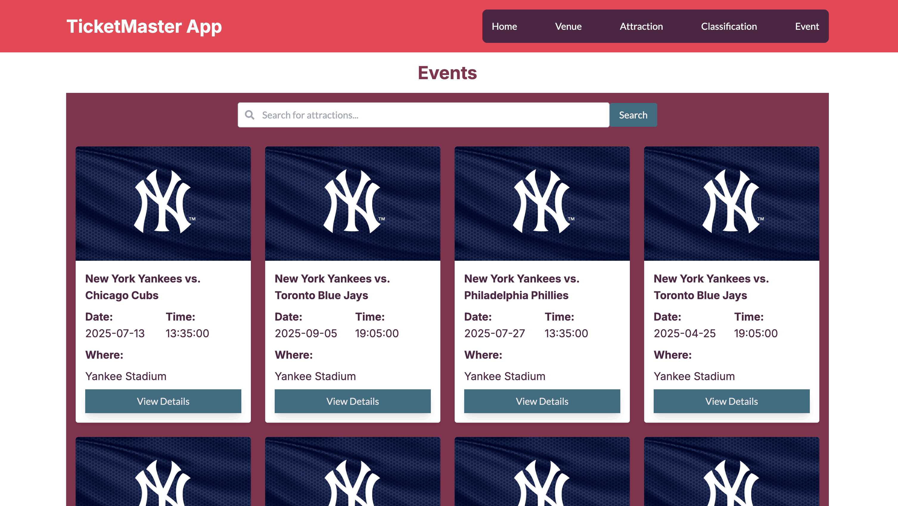
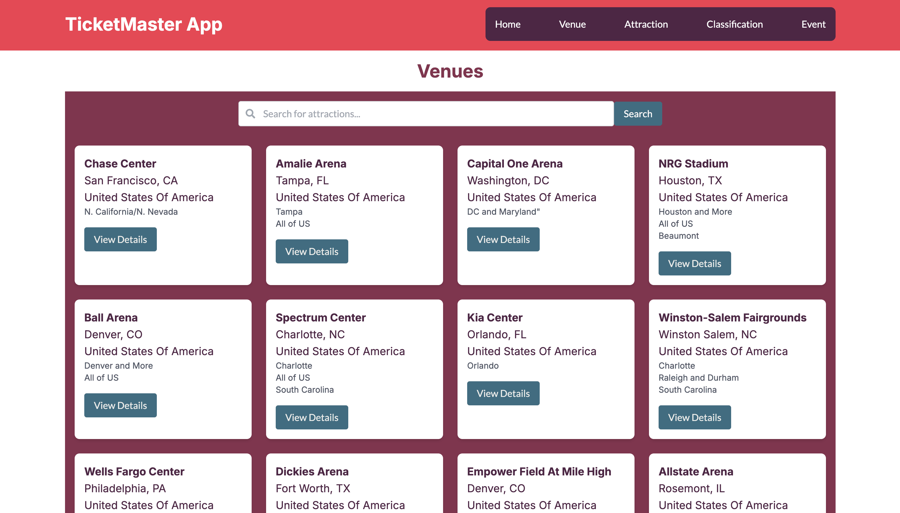

# Ticket Master App in React and Typescript



Ticket Master is a modern web application built with React and TypeScript, designed to help users manage and organize event tickets efficiently. It features a sleek and responsive UI, powered by Tailwind CSS, and leverages Zustand for state management. With smooth animations provided by Framer Motion, the app delivers an engaging user experience.

It uses Typescript for type safety and ensures better code maintainability and scalability. By combining the power of TypeScript with React, the app benefits from:

- **Type Safety**: Catch errors during development, reducing runtime bugs.
- **Improved Developer Experience**: Autocompletion and IntelliSense support in IDEs.
- **Easier Refactoring**: Strongly typed code makes it easier to refactor and maintain.
- **Enhanced Collaboration**: Clear type definitions improve team collaboration by reducing ambiguity.

## Features

- **Search for Venues**: Easily find venues for events with detailed information.
- **Attraction Discovery**: Explore attractions and performers with relevant details.
- **Event Search**: Look up events by date, location, or category to plan your schedule.
- **Responsive Design**: Enjoy a seamless experience across devices.
- **Smooth Animations**: Navigate the app with visually appealing transitions.
- **State Persistence**: Retain user preferences and data using Zustand.

## Project Screenshots

Please find some of the screenshots below showing events, venues and attractions





## Technologies used

* React - For UI development
* Tailwind CSS - For CSS component styling
* Typescript - For declaring types and autocomplete code help
* Zustand - For data store management
* Framer-Motion - For smooth page transitions and other animations

## State Management using zustand

Zustand is a small, fast, and scalable state management solution for React applications. It provides a simple API and leverages hooks to manage state in a more intuitive way compared to traditional state management libraries.

Unlike React Redux, which relies on a centralized store and actions to update the state, Zustand allows you to create multiple stores and directly mutate the state within the store. This can lead to more concise and readable code. Additionally, Zustand does not require boilerplate code such as action creators and reducers, making it easier to set up and use.

## Running the Project

To run the project locally, follow these steps:

1. **Clone the repository**:
  ```sh
  git clone https://github.com/apfirebolt/react_ticketmaster.git
  cd react_ticketmaster
  ```

2. **Install dependencies**:
  ```sh
  npm install
  ```

3. **Start the development server**:
  ```sh
  npm run dev
  ```

4. **Open your browser** and navigate to `http://localhost:3000` to see the application running.

For a production build, you can run:
```sh
npm run build
```
This will create an optimized build of the application in the `dist` folder.

## How to Contribute

1. Fork the repository.
2. Create a new branch (`git checkout -b feature-branch`).
3. Make your changes.
4. Commit your changes (`git commit -m 'Add some feature'`).
5. Push to the branch (`git push origin feature-branch`).
6. Open a pull request.

Thank you for your contributions!
git